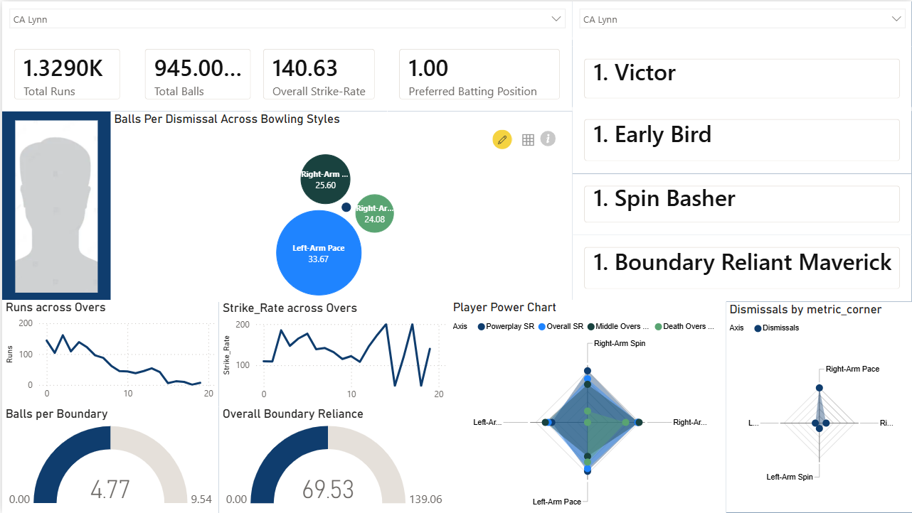

# IPL Player Archetype & Scouting Dashboard

## Overview

Modern cricket analysis often focuses on aggregate statistics such as runs, averages, and strike rates. While useful, these metrics rarely explain *how* a player scores runs, *when* they are most effective, or *which matchups suit their game*.

This project develops an interactive IPL player scouting platform that combines ball-by-ball data, matchup analytics, phase-wise performance metrics, and a custom player archetype framework to profile batters beyond traditional statistics.

The dashboard allows users to explore player behavior, scoring patterns, preferred batting roles, and bowling-style matchups through a single scouting interface.

---

## Objectives

The project aims to answer questions such as:

- Is a batter an opener, consolidator, or finisher?
- Does a player rely heavily on boundaries or strike rotation?
- Which bowling styles does a batter perform best against?
- How does scoring intent change across innings phases?
- Can players be grouped into meaningful behavioral archetypes?

---

## Dataset

### Source

IPL Ball-by-Ball Dataset (2008–2022)

### Granularity

Every delivery contains information such as:

- Batter
- Bowler
- Runs scored
- Dismissal events
- Over number
- Innings information
- Bowling style

The ball-level structure enables detailed behavioral analysis rather than relying solely on aggregate scorecards.

---

## Dashboard Features

### Player Summary Layer

Provides career-level performance metrics:

- Total Runs
- Total Balls Faced
- Overall Strike Rate
- Preferred Batting Position

---

### Over-by-Over Analysis

Tracks scoring behavior throughout an innings:

- Runs across overs
- Strike Rate across overs

This helps identify:

- Fast starters
- Anchors
- Finishers

---

### Boundary Analysis

Measures scoring dependence using:

#### Balls Per Boundary (BPB)

Number of balls required to hit a boundary.

#### Boundary Reliance

Percentage of runs scored through boundaries.

These metrics distinguish aggressive boundary hitters from strike rotators.

---

### Matchup Analytics

Performance is evaluated against four bowling categories:

- Right-Arm Pace
- Left-Arm Pace
- Right-Arm Spin
- Left-Arm Spin

Metrics include:

- Strike Rate
- Dismissals
- Relative strengths and weaknesses

---

### Radar-Based Player Profiling

Radar charts summarize:

- Matchup performance
- Bowling-style preferences
- Scoring strengths

This creates a compact scouting profile for each batter.

---

## Player Archetype Framework

A custom four-dimensional player classification system was developed.

Each player receives one label from each category.

---

### 1. Phase Archetype

Describes when a player typically operates.

| Archetype | Description |
|------------|------------|
| Early Bird | Top-order aggressor |
| Middle Piece | Stabilizes innings |
| End Executioner | Finishing specialist |
| Day Long Engine | Long-duration accumulator |

---

### 2. Boundary Type

Describes scoring style.

| Archetype | Description |
|------------|------------|
| Boundary Reliant Maverick | Heavy boundary dependence |
| Air Bender | Strong aerial boundary game |
| Subcontinental Carpet Finder | Ground-stroke specialist |
| Rotator | Relies on strike rotation |

---

### 3. Bowling Favourite

Describes preferred matchups.

| Archetype | Description |
|------------|------------|
| Spin Basher | Excels against spin |
| Velocidad Exploiter | Excels against pace |
| Dual Style Run Machine | Strong against both |
| Accumulator | Consistent but matchup-neutral |

---

### 4. Intent Archetype

Captures overall scoring mindset.

| Archetype | Description |
|------------|------------|
| Victor | High-volume match winner |
| Strike Rate Powerhouse | Aggressive scorer |
| Short Rocket | High-impact Low Duration player |
| Iron Tail | Strong at End |

---

## Example Player Profile

A player may be classified as:

```text
Victor
Early Bird
Spin Basher
Boundary Reliant Maverick
```

This provides a concise summary of their batting identity.

---

## Technical Pipeline

```text
Raw Ball-by-Ball Data
           │
           ▼
SQL Feature Engineering
           │
           ▼
Player-Level Aggregation
           │
           ▼
Matchup Analysis
           │
           ▼
Archetype Classification
           │
           ▼
Power BI Dashboard
```

---

## Technologies Used

- MySQL
- Power BI
- Data Modeling
- Sports Analytics

---

## Key Insights

1. Traditional batting statistics fail to fully describe player behavior.

2. Batters can be profiled using a combination of:
   - Matchup preferences
   - Scoring intent
   - Boundary dependence
   - Innings phase contribution

3. Similar overall statistics often hide fundamentally different player styles.

4. Archetype-based profiling provides a more intuitive scouting framework than raw statistics alone.

---
## Sample Visual


## Applications

### Player Scouting

Identify player strengths, weaknesses, and matchup preferences.

### Team Composition

Build balanced batting lineups using complementary archetypes.

### Opposition Analysis

Study vulnerabilities against specific bowling styles.

### Talent Identification

Discover emerging players with profiles similar to established stars.

---

## Future Work

Potential extensions include:

- Similar Player Recommendation Engine
- K-Means Archetype Discovery
- Auction Value Prediction
- Playing XI Optimization
- Matchup-Based Team Selection
- Win Contribution Modeling

---

## Author

**K. Aakanksh Reddy**  
ECE Undergraduate, IIT Kharagpur

### Areas of Interest

- Data Science
- Machine Learning
- Signal Processing
- VLSI (Hardware)